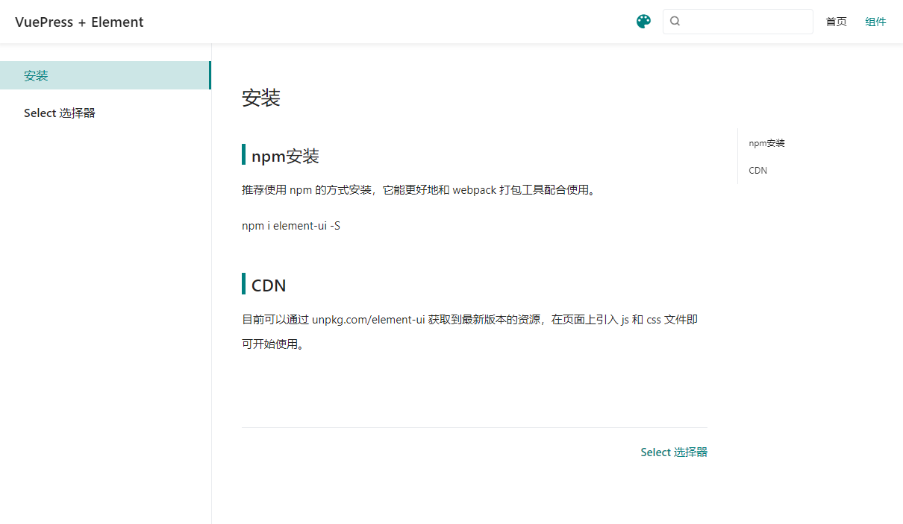
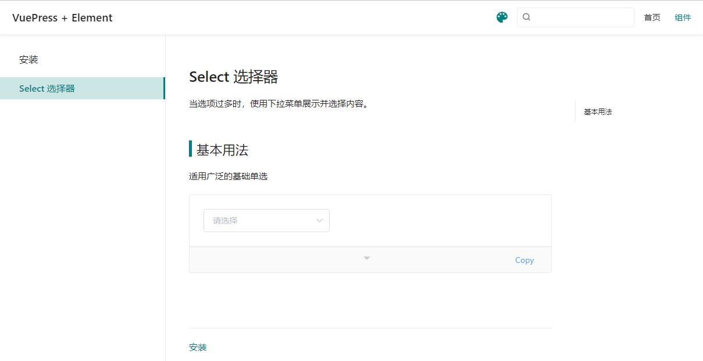

> vuepress搭建类似组件库文档demo
### 效果


### 使用
- npm run dev 本地启动
- 在config.js中 配置对应的菜单路径，如下配置，设置后vuepress将mc文件渲染为html

### vuepress配置
```
// 目录 docs/.vuepress/config.js 
module.exports = {
  theme: 'reco',
  title: 'VuePress + Element',
  description: 'VuePress搭建Element的组件库文档教程示例代码',
  base: '/',
  port: '8080',
  themeConfig: {
     nav: [
      {
        text: '首页',
        link: '/'
      },
      {
        text: '组件',
        link: '/comps/'
      }
    ],
    sidebar: { // 配置侧边栏部分
      '/comps/': ['/comps/', '/comps/select.md']
    }
  },
  head: [],
  plugins: ['demo-container'], // 配置插件
  markdown: {}
}

```
### 引入组件
```

// 2. 做一些Vue应用级别的配置时，就需要在这个文件里面配置
// 目录 docs/.vuepress/enhanceApp.js 
import ElementUI from 'element-ui';
import 'element-ui/lib/theme-chalk/index.css';

export default async ({
  Vue
}) => {
  if (typeof process === 'undefined') {
    Vue.use(ElementUI)
  }
}
```

### 部署
- 执行 npm run build
- 部署打包后的 /docs/.vuepress/dist/ 目录

### 修改主题色
- .vuepress/styles/palette.styl 文件，文件代码如下

```
$accentColor = #3178c6
```

### 自定义样式
- VuePress 提供了一种添加额外样式的简便方法。创建一个 `.vuepress/styles/index.styl` 文件

```
// 通过检查，查看元素样式声明
.dark .content__default code {
    background-color: rgba(58,58,92,0.7);
    color: #fff;
}
.page .page-title {
   display: none;
}
```


### 参考资料
- [vuepress官方文档](https://www.vuepress.cn/guide/getting-started.html)
- 组件展示效果 [demoContainer插件](https://docs.chenjianhui.site/vuepress-plugin-demo-container/zh/)